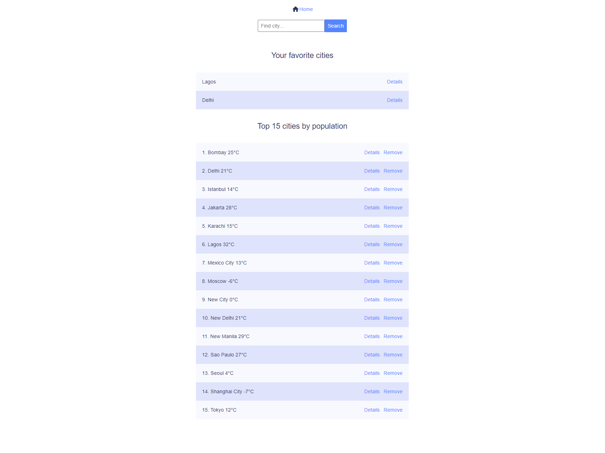
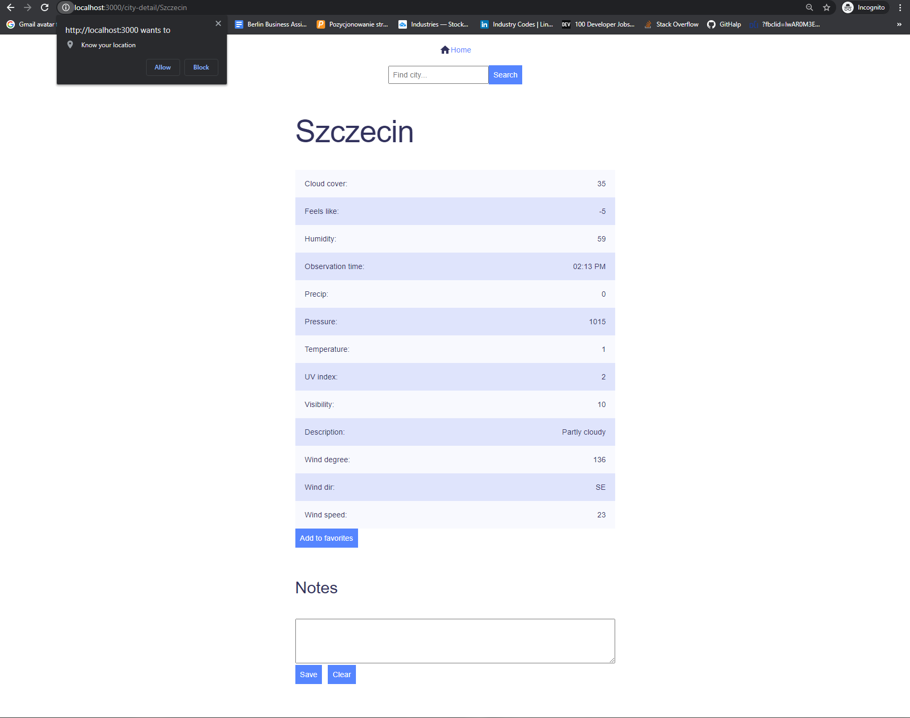

## Main description

Front End Software Engineer Test Assignment




## Technological stack

- styled-components
- typescript
- cra
- react
- react-router
- axios
- Google Cloud API
- WeatherStack Free API

## Required .env variable to run an app

```
REACT_APP_WEATHERSTACK_API_KEY = XYZ
REACT_APP_GOOGLE_MAP_API_KEY = XYZ
```

## Directories structure

All code is under /src directory

- assets - directory for static assets like .svg icons
- components - reusable components in the wole application like button
- global - components that are used once in a whole application to provide some functionality like RWD provider or layout
- helpers - functions that can be reused in few places in whole application
- pages - component responsible for given url adress like /home -> Home.tsx component

## What I haven't done, but I am aware of, because app was to small for it or it was not required
- redux/react-cache/apollo - global store management mechanism
- prettier/eslint
- RWD (Responsive Web Design)
- more unit/integral/e2e tests
- babel aliases
- handle complex API Types (:any at some places)

## Available Scripts

In the project directory, you can run:

### `yarn start`

Runs the app in the development mode.\
Open [http://localhost:3000](http://localhost:3000) to view it in the browser.

The page will reload if you make edits.\
You will also see any lint errors in the console.

### `yarn test`

Launches the test runner in the interactive watch mode.\
See the section about [running tests](https://facebook.github.io/create-react-app/docs/running-tests) for more information.

### `yarn build`

Builds the app for production to the `build` folder.\
It correctly bundles React in production mode and optimizes the build for the best performance.

The build is minified and the filenames include the hashes.\
Your app is ready to be deployed!

See the section about [deployment](https://facebook.github.io/create-react-app/docs/deployment) for more information.

### `yarn eject`

**Note: this is a one-way operation. Once you `eject`, you can’t go back!**

If you aren’t satisfied with the build tool and configuration choices, you can `eject` at any time. This command will remove the single build dependency from your project.

Instead, it will copy all the configuration files and the transitive dependencies (webpack, Babel, ESLint, etc) right into your project so you have full control over them. All of the commands except `eject` will still work, but they will point to the copied scripts so you can tweak them. At this point you’re on your own.

You don’t have to ever use `eject`. The curated feature set is suitable for small and middle deployments, and you shouldn’t feel obligated to use this feature. However we understand that this tool wouldn’t be useful if you couldn’t customize it when you are ready for it.

## Learn More

You can learn more in the [Create React App documentation](https://facebook.github.io/create-react-app/docs/getting-started).

To learn React, check out the [React documentation](https://reactjs.org/).
